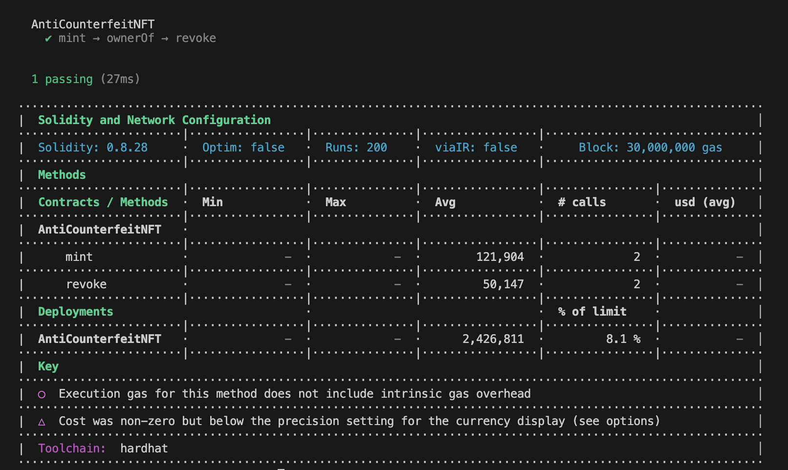
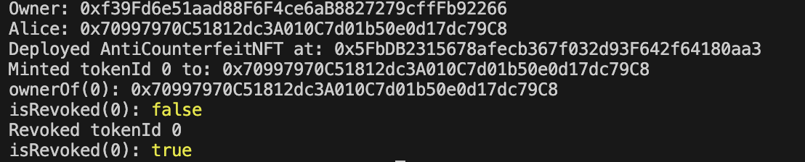

🛡️ AntiCounterfeitNFT (ACNFT)

A minimal Web3 project that demonstrates how NFTs can be used for anti-counterfeit verification.
Built with Hardhat, Solidity, and TypeScript.

✨ Features

Mint → Owner can issue NFTs as certificates of authenticity.

Revoke → Owner can revoke an NFT (mark as counterfeit).

Pause/Unpause → System can be paused to stop minting when necessary.

ERC721URIStorage → Each NFT carries a metadata URI (e.g., IPFS link).

📂 Project Structure

acnft/
├── contracts/ # Solidity smart contracts
│ └── AntiCounterfeitNFT.sol
├── scripts/ # Demo scripts
│ └── demo.ts
├── test/ # Unit tests
│ └── AntiCounterfeitNFT.test.ts
├── images/ # Project screenshots
│ ├── test-result.png
│ └── demo-output.png
├── hardhat.config.ts # Hardhat config
└── README.md # Project documentation

⚡ Getting Started

Install dependencies
npm install

Compile contracts
npx hardhat compile

Run tests
npx hardhat test

Run demo script
npx hardhat run scripts/demo.ts

Expected output:
Owner: 0x...
Alice: 0x...
Deployed AntiCounterfeitNFT at: 0x...
Minted tokenId 0 to: 0xAlice...
ownerOf(0): 0xAlice...
isRevoked(0): false
Revoked tokenId 0
isRevoked(0): true

🧪 Example Test

This project includes a unit test to verify:

Minting assigns the correct owner.

Revoking marks the token as revoked.

Run only this test:
npx hardhat test test/AntiCounterfeitNFT.test.ts

📸 Demo Screenshots

Hardhat test result

Demo script output

## 🌐 Deployments
- Sepolia: [0xd88c83F5E503e7c7c52891b488e0Bd2507e4a20f](https://sepolia.etherscan.io/address/0xd88c83F5E503e7c7c52891b488e0Bd2507e4a20f#code)

🌐 Next Steps

Upload NFT metadata to IPFS.

Build a simple frontend verifier (scan QR → show ownerOf, tokenURI, isRevoked).

📜 License

MIT